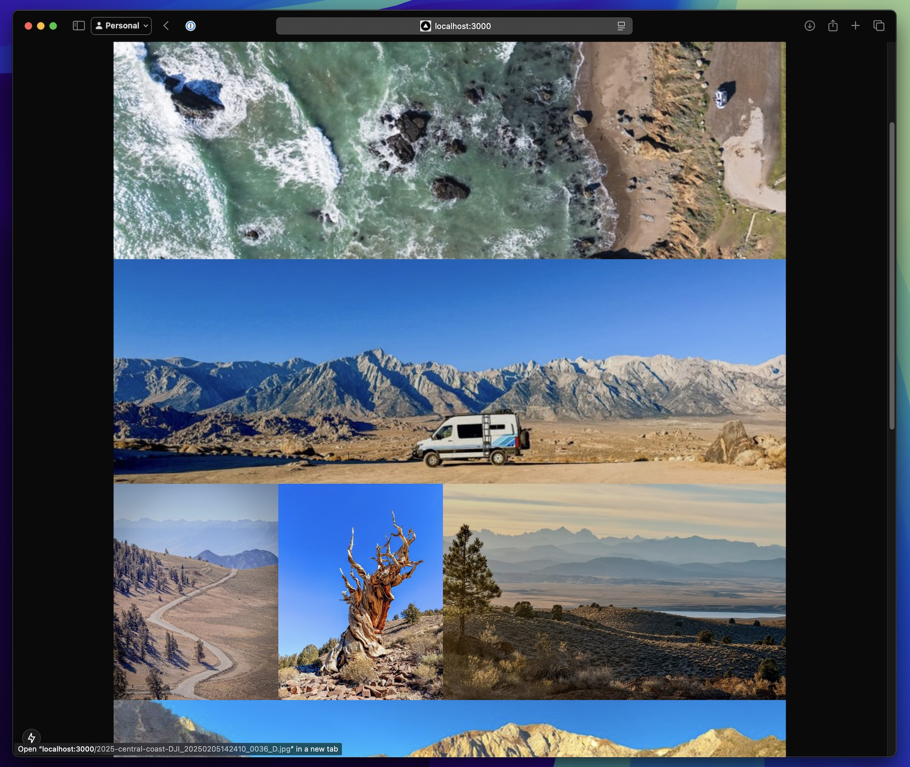

# Personal Photo/Video Gallery



A high-performance, statically-generated photo and video gallery built with Next.js. Designed for simplicity and speed, it handles large media collections with ease while maintaining a beautiful, responsive interface.

## ✨ Features

- **Masonry Grid Layout** - Beautifully arranged photos and videos in a responsive grid
- **Lightning Fast** - Optimized media loading and smooth scrolling experience
- **High Quality** - Support for large images (10MB+) and videos (350MB+)
- **Simple Management** - Folder-based organization with minimal metadata requirements
- **Mobile Friendly** - Responsive design with touch-friendly navigation
- **Direct Linking** - Share specific photos/videos with clean URLs

## 🚀 Performance

- Fast initial page load
- Lazy loading for media
- Automatic thumbnail generation
- Video preview optimization
- Smooth scrolling experience

## 🛠 Tech Stack

- **Next.js** - Server components and static generation
- **TypeScript** - Type-safe development
- **TailwindCSS** - Utility-first styling
- **Sharp** - Image processing and optimization
- **FFmpeg** - Video processing and previews

## 📦 Installation

1. Clone the repository:
```bash
git clone [repository-url]
cd photo-gallery
```

2. Install dependencies:
```bash
npm install
```

3. Add your media:
- Place photos/videos in `public/photos/[section-name]/`
- Run media processing:
```bash
npm run process-media
```

4. Start development server:
```bash
npm run dev
```

## 🎯 Development

### Prerequisites
- Node.js (v18+)
- FFmpeg (for video processing)

### Key Commands
```bash
# Start development server
npm run dev

# Process media (generate thumbnails/previews)
npm run process-media

# Build for production
npm run build
```

## 📁 Project Structure

```
photo-gallery/
├─ app/                # Next.js App Router
│  ├─ page.tsx        # Main gallery page
│  ├─ [id]/           # Dynamic image routes
│  └─ components/     # Shared components
├─ public/photos/     # Media files
├─ lib/               # Utilities
└─ scripts/           # Build scripts
```

## 🌟 Media Support

### Images
- Formats: jpg, png, webp
- Size: Up to 10MB
- Auto-generated thumbnails

### Videos
- Formats: mp4, mov
- Size: Up to 350MB
- Auto-generated previews
- Thumbnail extraction

## 📱 Browser Support

- Modern browsers (last 2 versions)
- Mobile browsers
- Progressive enhancement

## 🚀 Deployment

Deploy on Vercel for optimal performance:

[](https://vercel.com/new/clone?repository-url=https%3A%2F%2Fgithub.com%2Fyour-username%2Fphoto-gallery)

## 📝 License

MIT License - feel free to use this project as you wish.
